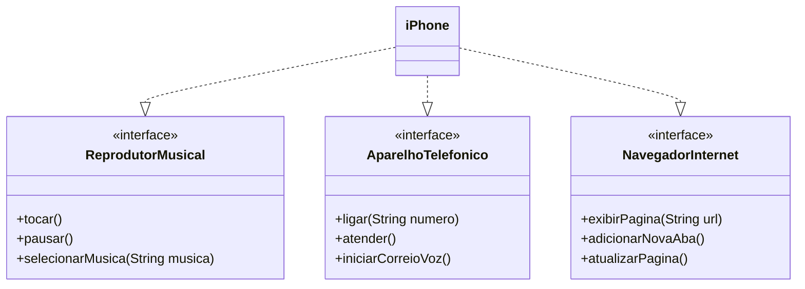

# DIO_Desafio_iPhoneUML
Prática dos fundamentos diagramação das classes/interfaces utilizando uma ferramenta UML.

[Desafio de modelagem e diagramação UML](https://github.com/digitalinnovationone/trilha-java-basico/tree/main/desafios/poo)

Como proposto no desafio, foi realizada a diagramação abaixo de um componente iPhone de primeira geração e a implementação simbolica na linguagem java.

